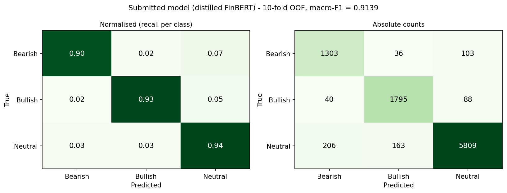

<div align="center">

# Financial Tweet Sentiment Classification

**From sparse NLP baselines to transformer ensembles and knowledge distillation.**
An end-to-end study of Bearish, Bullish, and Neutral sentiment in financial social media.

[](https://github.com/tiagoslantunes/text-mining-financial-sentiment/actions/workflows/quality.yml)
[](https://www.python.org/downloads/release/python-3110/)
[](https://pytorch.org/)
[](https://huggingface.co/datasets/zeroshot/twitter-financial-news-sentiment)
[](LICENSE)

</div>

Developed at NOVA Information Management School for the 2025/2026 Text Mining course, this group project received the maximum mark. It evaluates the complete NLP workflow: data quality, preprocessing, feature engineering, classical machine learning, transformer fine-tuning, ensembling, knowledge distillation, and an offline agentic routing experiment.

> [!NOTE]
> This is a research and educational artifact, not financial advice or a trading system.

## Highlights

| | Result |
|---|---:|
| Training corpus | 9,543 labelled financial tweets |
| Task | 3-class sentiment classification |
| Submitted model | Distilled FinBERT, 110M parameters |
| Submitted model OOF macro-F1 | **0.9139** |
| Submitted model OOF accuracy | **0.9334** |
| Teacher ensemble OOF macro-F1 | **0.9201** |
| Primary evaluation | 10-fold stratified out-of-fold evaluation, seed 42 |

The submitted model retains most of the eight-encoder teacher's performance at single-model inference cost. The largest remaining errors occur near the Neutral/directional boundary rather than between Bearish and Bullish examples.



## What we investigated

1. **Data quality and EDA** — class imbalance, tweet length, cashtags, encoding corruption, near-duplicates, label noise, and train/test shift.
2. **Preprocessing** — conservative Unicode repair with `ftfy` versus increasingly destructive cleaning pipelines.
3. **Representations** — BoW, word- and character-level TF-IDF, Word2Vec, GloVe, SBERT, and frozen transformer embeddings.
4. **Models** — 68 classical model/feature combinations, GPT-2, FinBERT, RoBERTa, DeBERTa, and finance/Twitter-specific encoders.
5. **Ensembling and compression** — coordinated soft voting followed by knowledge distillation into a single FinBERT student.
6. **Agentic workflow** — adaptive routing between VADER, LightGBM + SBERT, and FinBERT without proprietary APIs.

## Project structure

| Path | Purpose |
|---|---|
| [`tm_tests_33.ipynb`](tm_tests_33.ipynb) | Executed experiment notebook: EDA, ablations, models, ensembles, and statistical analysis |
| [`tm_final_33.ipynb`](tm_final_33.ipynb) | Compact submitted pipeline and reproducible prediction artifact |
| [`notebooks/`](notebooks) | Offline adaptive-routing agent demonstration |
| [`src/`](src) | Reusable preprocessing, feature, evaluation, and agent modules |
| [`scripts/`](scripts) | Training, distillation, ensembling, and analysis entry points |
| [`results/`](results) | Committed metrics, figures, and prediction caches |
| [`figures/`](figures) | Exploratory data analysis figures |
| [`docs/`](docs) | Final academic report and reproducibility guide |
| [`tests/`](tests) | Artifact and label-consistency checks |
| [`MODEL_CARD.md`](MODEL_CARD.md) | Intended use, evaluation, limitations, and responsible-use notes |

Notebooks are executed from the repository root, so their relative paths to `data/`, `src/`,
and `results/` resolve. They include their stored outputs, so the full analysis can be reviewed
without downloading model weights or using a GPU.

## Quick start

Python 3.11 was used for the final experiments. A CUDA-capable GPU is recommended for transformer training, but it is not required to inspect the notebooks or run the lightweight checks.

```bash
git clone https://github.com/tiagoslantunes/text-mining-financial-sentiment.git
cd text-mining-financial-sentiment

python -m venv .venv
# Windows: .venv\Scripts\activate
# macOS/Linux: source .venv/bin/activate

python -m pip install --upgrade pip
python -m pip install -r requirements.txt
python -m jupyter lab
```

Open `tm_final_33.ipynb`, restart the kernel, and run all cells. With the committed probability caches this takes about two minutes and recreates `pred_33.csv`. Removing the caches triggers distillation from the teacher probabilities and requires a suitable GPU.

For command-line reproduction, exact configurations, output conventions, and expected runtimes, see [`docs/reproducibility.md`](docs/reproducibility.md).

## Data

The course split corresponds to the [Twitter Financial News Sentiment dataset](https://huggingface.co/datasets/zeroshot/twitter-financial-news-sentiment): 11,931 English finance-related tweets labelled `0 = Bearish`, `1 = Bullish`, and `2 = Neutral`. The upstream dataset card identifies the dataset license as MIT.

The local files preserve the course-provided train/test format and contain some encoding variants that are analysed in the project. See [`data/README.md`](data/README.md) for provenance, schema, and caveats.

## Reproducibility

- All randomised experiments use seed `42`.
- Transformer comparisons use identical stratified folds where probability-level comparison is required.
- Reported transformer metrics are out-of-fold, so every prediction comes from a model that did not train on that sample.
- The final submission, synchronized prediction copies, and class labels are covered by automated tests.
- Large neural-model weights and dense intermediate embeddings are intentionally excluded; compact metrics, probability caches, and the lightweight agent model are committed.

## Quality checks

Every push runs [`quality.yml`](.github/workflows/quality.yml) on GitHub Actions, which verifies
the committed artifacts and label consistency without needing a GPU. To run the same checks
locally:

```bash
python -m pip install -r requirements-test.txt
python -m unittest discover -s tests -v
```

## Authors

- Alexandra Varela
- Francisca Fernandes
- Mariana Melo
- Tiago Antunes

See [`CITATION.cff`](CITATION.cff) for machine-readable citation metadata. Contributions and project context are documented in the notebooks and report.

## License

The upstream dataset has its own MIT license. The original code and written material in this repository are shared for viewing under an all-rights-reserved notice; see [LICENSE](LICENSE). Reuse beyond what copyright law permits requires the authors' prior written permission.
